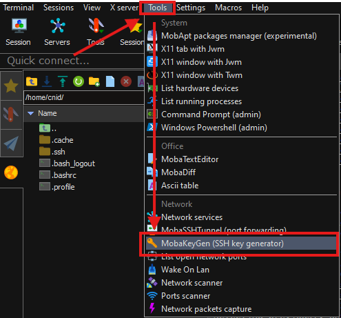

# Proxmox Setup with 1 Public IP

## Requirements

* A dedicated server (you can get it from [Fiberstate](https://billing.fiberstate.com/aff.php?aff=185)), some others may work but may need additional tweaks to hardware identifiers
* A SSH Client (we used [MobaXterm](https://mobaxterm.mobatek.net) but you can use PuTTY or OpenSSH or the built in SSH client)

## Server Preparation

We recommend to get this server spec (R9 7950X)

<figure><figcaption></figcaption></figure>

Input your desired Hostname and Password, and for the Operating System choose Proxmox (latest)\


<figure><figcaption></figcaption></figure>


They have double drive promo on going, drop your invoice number to their [forum thread here](https://lowendtalk.com/discussion/200196/b-l-a-c-k-o-u-t-f-r-i-d-a-y-fiberstate-mega-event-new-la2-dc-giveaways-kaboom#latest)


Go to your web browser and access your proxmox web console by accessing this URL <kbd>https://\<SERVER\_IP>:8006</kbd> and use root as username and the password you set previously

<figure><figcaption></figcaption></figure>


Additionally, you can run this script for post installation setup for basic proxmox tweak


```sh
bash -c "$(wget -qLO - https://github.com/community-scripts/ProxmoxVE/raw/main/misc/post-pve-install.sh)"
```



### Prepare SDN function

Login to your server via SSH and run this command

```sh
apt update
apt -y install dnsmasq
# disable default instance
systemctl disable --now dnsmasq
```

Make sure you have this line in your <kbd>/etc/network/interfaces</kbd> file

```sh
source /etc/network/interfaces.d/*
```

type the following command to check

```sh
cat /etc/network/interfaces
```

If <kbd>source /etc/network/interfaces.d/\*</kbd> is present, proceed; if not, add it to the file by using this command

```sh
printf "\n\nsource /etc/network/interfaces.d/*" >> /etc/network/interfaces
```

### Creating SDN Network (Private IP)

Go to your Proxmox web console and go to <kbd>Datacenter > SDN > Zones > Add > Simple</kbd>

<figure><figcaption></figcaption></figure>

Tick the <kbd>Advanced</kbd> option, put <kbd>ID</kbd> with any name you like (in this case we use <kbd>cnid</kbd>) and tick the <kbd>automatic DHCP</kbd>

<figure><figcaption></figcaption></figure>

Go to <kbd>SDN > VNets</kbd> and <kbd>Create</kbd>

<figure><figcaption></figcaption></figure>

Input the any name (in this case <kbd>vnet1</kbd>) and select the zone that you created previously (in this case <kbd>cnid</kbd>)

<figure><figcaption></figcaption></figure>

Click on the newly created vnet and on the right side, click create

<figure><figcaption></figcaption></figure>

Input your own <kbd>Subnet</kbd> and <kbd>Gateway</kbd>, you can customize it or just follow, and then go to <kbd>DHCP Ranges</kbd>

<figure><figcaption></figcaption></figure>

Click Add and input your desired IP range (in this case <kbd>10.100.0.100 - 10.100.0.200</kbd> ; more than enough) then <kbd>Create</kbd>

<figure><figcaption></figcaption></figure>

After this setup, go to <kbd>SDN</kbd> and click <kbd>Apply</kbd>

<figure><figcaption></figcaption></figure>

After that go to <kbd>IPAM</kbd> and you can manage your DHCP reservation (this image taken from my running server)

<figure><figcaption></figcaption></figure>

### Download OS Image

Go to <kbd>local storage > ISO Images > Download from URL</kbd>

<figure><figcaption></figcaption></figure>

We will download ubuntu 24.04 iso for later VM setup

Input this <kbd>`https://releases.ubuntu.com/24.04.2/ubuntu-24.04.2-live-server-amd64.iso`</kbd> to <kbd>URL</kbd> field and click on <kbd>Query URL</kbd>

you can rename the file if you wish and click <kbd>Download</kbd>

<figure><figcaption></figcaption></figure>


Now you've done the server preparation, we will continue to VM Setup


## VM Setup

Simply click on <kbd>Create VM</kbd> button on top right of your interface

### General

Tick on <kbd>Advanced</kbd> box > tick on <kbd>Start at boot</kbd> > put the server name > <kbd>Next</kbd>

<figure><figcaption></figcaption></figure>

### OS

Select <kbd>local</kbd> storage > choose the <kbd>ISO Image</kbd> that you downloaded in previous step > <kbd>Next</kbd>

<figure><figcaption></figcaption></figure>

### System

Just next, nothing to change there

### Disks

Select <kbd>local-lvm</kbd> in the <kbd>Storag</kbd>e section > put <kbd>100</kbd> for <kbd>Disk size</kbd> > <kbd>Next</kbd>

<figure><figcaption></figcaption></figure>

### CPU

Set <kbd>Sockets</kbd> and <kbd>Cores</kbd> depends to your need and <kbd>Type</kbd> to <kbd>host</kbd> for the best performance > <kbd>Next</kbd>

<figure><figcaption></figcaption></figure>

### Memory

Set the <kbd>Memory</kbd> depends on your need > <kbd>Next</kbd>&#x20;

<figure><figcaption></figcaption></figure>

### Network

Select the bridge that you created previously > <kbd>Next</kbd>

<figure><figcaption></figcaption></figure>

### Confirm

In the confirmation page, you will see the summary of the VM. Optionally, you can tick <kbd>Start after created</kbd> so it will start immediately > <kbd>Finish</kbd>

<figure><figcaption></figcaption></figure>

### OS Installation

After VM Creation, go to <kbd>Datacenter</kbd> > <kbd>your server name</kbd> > <kbd>Console</kbd>

<figure><figcaption></figcaption></figure>

Continue the installation as prompted

<figure><figcaption><p>Done</p></figcaption></figure>

<figure><figcaption><p>Done</p></figcaption></figure>

<figure><figcaption><p>Done</p></figcaption></figure>

<figure><figcaption><p>Done</p></figcaption></figure>

<figure><figcaption><p>Done</p></figcaption></figure>



In this part, remember to allocate all your disk space

Select <kbd>ubuntu-lv</kbd> > <kbd>Edit</kbd>

Set maximum <kbd>Size</kbd> and then <kbd>Save</kbd> > <kbd>Done</kbd> > <kbd>Continue</kbd>


<figure><figcaption></figcaption></figure>

<figure><figcaption></figcaption></figure>

<figure><figcaption></figcaption></figure>

<figure><figcaption><p>Input your name, server name, username and password > <kbd>Done</kbd></p></figcaption></figure>

<figure><figcaption><p>Continue</p></figcaption></figure>

<figure><figcaption><p>Mark to <kbd>Install OpenSSH Server</kbd> > <kbd>Done</kbd></p></figcaption></figure>

<figure><figcaption><p>Tick any features you want to install (in this case, I skipped everything) > <kbd>Done</kbd></p></figcaption></figure>

<figure><figcaption><p>Wait for the installation process until it's completed > <kbd>Reboot Now</kbd></p></figcaption></figure>

<figure><figcaption><p>If you see this screen, just press <kbd>ENTER</kbd></p></figcaption></figure>

After that, go to <kbd>Hardware</kbd> menu > select the <kbd>ISO Image drive</kbd> > <kbd>Remove</kbd> > <kbd>Reboot</kbd> once again

<figure><figcaption></figcaption></figure>


Now you have created a VM and it's ready to use



Repeat the process for more VM, or can use Clone VM option


<figure><figcaption></figcaption></figure>
